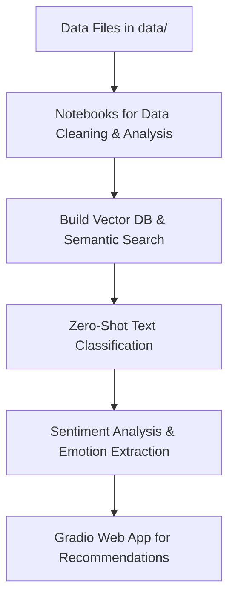

Below is a complete README file in Markdown format that you can use directly in your Git repository. Simply create a file named `README.md` in your repo root and paste the following content:

```markdown
# Semantic Book Recommender with LLMs – Full Course

This repository contains all of the code to complete the freeCodeCamp course, **"Build a Semantic Book Recommender with LLMs – Full Course"**. The project is organized into five major components:

1. **Text Data Cleaning:**  
   Explore and clean the book data using the notebook [`data-exploration.ipynb`](notebooks/data-exploration.ipynb).

2. **Semantic (Vector) Search & Vector Database:**  
   Build a vector database to enable similarity search over book descriptions in [`vector-search.ipynb`](notebooks/vector-search.ipynb).

3. **Zero-Shot Text Classification:**  
   Classify books (e.g., fiction vs. non-fiction) using LLMs in [`text-classification.ipynb`](notebooks/text-classification.ipynb).

4. **Sentiment Analysis & Emotion Extraction:**  
   Analyze sentiment and extract emotions (e.g., joyful, suspenseful) from book descriptions in [`sentiment-analysis.ipynb`](notebooks/sentiment-analysis.ipynb).

5. **Gradio Web Application:**  
   Get interactive book recommendations through a Gradio dashboard implemented in [`gradio-dashboard.py`](gradio-dashboard.py).

## Repository Structure

```plaintext
semantic-book-recommender/
├── data/
│   ├── books_with_emotions.csv        # Book data with emotion columns, categories, etc.
│   └── tagged_description.txt         # Text file with tagged book descriptions
├── notebooks/
│   ├── data-exploration.ipynb         # Notebook for data cleaning and exploration
│   ├── vector-search.ipynb            # Notebook for building the vector DB and similarity search
│   ├── text-classification.ipynb      # Notebook for zero-shot text classification
│   └── sentiment-analysis.ipynb       # Notebook for sentiment analysis / emotion extraction
├── gradio-dashboard.py                # Code for the Gradio web application interface
├── requirements.txt                   # List of Python dependencies
├── .env                               # Environment variables (e.g., API keys)
└── README.md                          # Project overview and instructions
```

## Getting Started

### Prerequisites

- **Python 3.11** (or 3.10/3.9 if compatibility issues arise)
- [KaggleHub](https://github.com/Kaggle/kaggle-api) (if you need to download data from Kaggle)
- Other dependencies as listed in [`requirements.txt`](requirements.txt)

### Installation

1. **Clone the Repository:**

   ```bash
   git clone https://github.com/yourusername/semantic-book-recommender.git
   cd semantic-book-recommender
   ```

2. **Create and Activate a Virtual Environment:**

   ```bash
   python -m venv .venv
   # On Windows:
   .venv\Scripts\activate
   # On macOS/Linux:
   source .venv/bin/activate
   ```

3. **Install the Dependencies:**

   ```bash
   pip install -r requirements.txt
   ```

4. **Configure Environment Variables:**

   Create a file called `.env` in the repository root and add your API keys if needed (e.g., for OpenAI or private Hugging Face models):

   ```env
   OPENAI_API_KEY=your_openai_api_key_here
   HUGGINGFACEHUB_API_TOKEN=your_hf_api_token_here
   ```

5. **Download the Data:**

   Follow the instructions provided in the repository to download the required data from Kaggle. Place the files (`books_with_emotions.csv` and `tagged_description.txt`) into the `data/` folder.

### Running the Project

- **Notebooks:**  
  Open and run the notebooks in the `notebooks/` folder using Jupyter Notebook or JupyterLab for data exploration, vector search, text classification, and sentiment analysis.

- **Gradio Dashboard:**  
  Launch the interactive Gradio web application with:

  ```bash
  python gradio-dashboard.py
  ```

  This command will start a local web server where you can enter natural language queries to get semantic book recommendations.

## Project Overview Diagram



## Dependencies

The project relies on the following Python libraries (see [`requirements.txt`](requirements.txt) for the complete list):

- `kagglehub`
- `pandas`
- `matplotlib`
- `seaborn`
- `python-dotenv`
- `langchain-community`
- `langchain-opencv`
- `langchain-chroma`
- `transformers`
- `sentence-transformers`
- `gradio`
- `notebook`
- `ipywidgets`

## Acknowledgements

- This project is based on the freeCodeCamp course **"Build a Semantic Book Recommender with LLMs – Full Course"**.
- Special thanks to the developers and communities behind [LangChain](https://python.langchain.com) and [Gradio](https://gradio.app) for their excellent tools and documentation.

## License

This project is open source and available under the [MIT License](LICENSE).

---

Feel free to fork, modify, and extend this repository as needed. Happy coding!
```

### How to Use

1. **Copy and paste** the content above into your `README.md` file.
2. **Update** any placeholder values (like repository URL, API keys, or username) as needed.
3. **Commit and push** the file to your Git repository.

This README provides a comprehensive overview, detailed instructions, and a clear diagram of the project workflow. Enjoy building your Semantic Book Recommender!
  
*Reputable Sources:*  
- [LangChain Documentation](https://python.langchain.com)  
- [Gradio Documentation](https://gradio.app/get_started)  
- [freeCodeCamp Course](https://www.freecodecamp.org)
